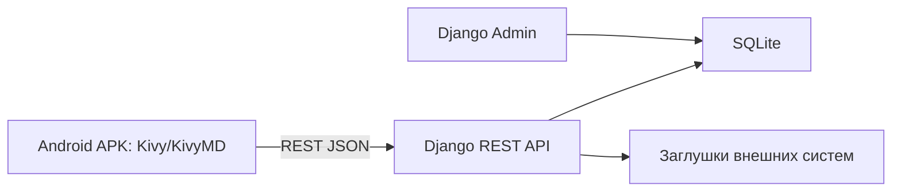

# План разработки Android-прототипа «Биржевой брокер»

> Визуальный прототип по ТЗ для Android. Клиентское приложение создаётся на
> Python с Kivy/KivyMD, серверная часть и административная панель — на Django.
> Реальные банковские интеграции заменяются демонстрационными заглушками.

## 1. Технологии

- **Android APK:** Python, Kivy, KivyMD.
- **Backend:** Django, Django REST Framework.
- **Административная панель:** Django Admin.
- **База прототипа:** SQLite.
- **Сборка APK:** Buildozer.
- **Обмен данными:** REST API в формате JSON.
- **Графики:** компоненты, построенные на демонстрационных данных.
- **Заглушки:** МСИ, SMS, биометрия, платежи, депозитарий, биржа и FIX/FAST.

## 2. Структура проекта

- `mobile/main.py` — запуск APK, тема и маршрутизация.
- `mobile/screens/` — Python-логика страниц.
- `mobile/ui/` — KV-разметка страниц и компонентов.
- `mobile/services/api.py` — связь APK с Django API.
- `mobile/assets/` — логотипы, иконки и изображения.
- `backend/manage.py` — управление Django.
- `backend/config/` — настройки и маршруты API.
- `backend/broker/` — модели, API, Django Admin и бизнес-данные.
- `backend/broker/fixtures/` — демонстрационные данные.
- `buildozer.spec` — настройки сборки APK.

## 3. Навигация

### До авторизации

- Главная.
- Тарифы.
- Обучение.
- Помощь.
- Вход и регистрация.

### После авторизации

Нижнее меню:

1. Главная.
2. Рынок.
3. Портфель.
4. Сервисы.
5. Профиль.

Быстрые действия:

- Пополнить.
- Вывести.
- Операции.
- Документы.

---

## 4. Страницы Android-приложения

### 4.1. Предавторизационная зона

1. **Заставка** — логотип и автоматический переход на стартовую страницу.
2. **Стартовая страница** — описание сервиса, кнопки входа и регистрации, ссылки на справочные разделы.
3. **Контакты банка** — телефон, почта, адрес, время работы, кнопки связи.
4. **Обратная связь** — тема, сообщение, контакты и результат отправки обращения.
5. **Тарифы и комиссии** — карточки тарифов и подробности комиссий.
6. **Лицензии и документы** — список и просмотр публичных документов.
7. **FAQ** — категории, поиск и раскрывающиеся ответы.
8. **Обучение** — материалы об акциях, облигациях, рисках, заявках и стакане.

### 4.2. Вход и регистрация

9. **Вход** — логин, пароль, восстановление доступа и переход к регистрации.
10. **Восстановление пароля** — ввод номера телефона и запрос кода.
11. **Подтверждение кода** — ввод демонстрационного одноразового кода.
12. **Новый пароль** — создание нового пароля и сообщение об успехе.
13. **Начало регистрации через МСИ** — описание шага и макет успешной идентификации.
14. **Создание учётной записи** — логин, пароль и подтверждение.
15. **Выбор 2FA** — SMS или биометрия как визуальный выбор.
16. **Анкета клиента** — ФИО, личный номер, паспорт, адрес и контакты.
17. **Проверка счетов и договора** — найденные счета и дальнейший маршрут клиента.
18. **Регистрация завершена** — резюме и переход в приложение.

### 4.3. Счёт депо

19. **Документы для открытия** — регламент, тарифы, оферта и чекбокс согласия.
20. **Подтверждение анкеты** — проверка данных перед отправкой.
21. **Статус открытия** — заявка отправлена, обработка, счёт открыт.
22. **Результат открытия** — номер счёта, дата и владелец.
23. **Счёт депо** — реквизиты, счёт выплат и доступные действия.
24. **Ценные бумаги депо** — название, эмитент, тикер, номинал, количество и валюта.
25. **Поручение на блокировку** — выбор бумаги, количества и подтверждение.
26. **Смена счёта выплат** — выбор нового счёта и результат перепривязки.

### 4.4. Главная и портфель

27. **Главная после входа** — баланс, доходность, события, новости и быстрые действия.
28. **Портфель** — акции, облигации, валюты, деньги и изменение стоимости.
29. **Аналитика портфеля** — диаграммы по активам, валютам и эмитентам.
30. **Брокерский счёт** — номер, валютные остатки и заблокированные средства.
31. **Обязательства** — форварды, РЕПО, суммы, сроки и статусы.

### 4.5. Рынок

32. **Каталог бумаг** — поиск, фильтры, акции и облигации с котировками.
33. **Карточка бумаги** — цена, параметры, избранное, новости и торговые действия.
34. **График цены** — линейный и свечной режимы, выбор периода.
35. **Биржевой стакан** — цены и объёмы заявок на покупку и продажу.
36. **История бумаги** — исторические цены и сделки за выбранный период.
37. **Новости эмитента** — связанные новости с переходом к полному материалу.

### 4.6. Покупка и продажа

38. **Параметры заявки** — операция, тип заявки, количество, цена и комиссия.
39. **Проверка заявки** — итог, доступный остаток, лимит и наличие бумаг.
40. **Подтверждение** — демонстрационное окно МСИ.
41. **Результат операции** — номер заявки, статус, сумма и комиссия.

### 4.7. История и отчёты

42. **Активные заявки** — новые, частично исполненные и выставленные заявки.
43. **История заявок** — исполненные, отменённые и отклонённые заявки.
44. **Детали заявки** — параметры и временная шкала статусов.
45. **История сделок** — покупки, продажи, количество, цена и итог.
46. **Отчёты брокера** — выбор периода и демонстрационное формирование PDF.

### 4.8. Сервисы

47. **Календарь инвестора** — дивиденды, купоны и погашения.
48. **Калькулятор доходности** — сумма, срок, ставка и ожидаемый результат.
49. **Новости рынка** — категории, поиск и лента новостей.
50. **Новость** — текст и связанные ценные бумаги.
51. **Инвестиционные идеи** — риск, срок, ожидаемая доходность и состав идеи.
52. **Тест риск-профиля** — вопросы, прогресс и результат профиля.
53. **Чат поддержки** — сообщения и подготовленные ответы оператора.

### 4.9. Договор и деньги

54. **Оферта договора комиссии** — текст, согласие и продолжение.
55. **Актуализация данных** — проверка клиентской анкеты.
56. **Карты и счета** — выбор реквизитов для пополнения и вывода.
57. **Договор комиссии** — номер, срок, статус, продление и закрытие.
58. **Пополнение** — карта, валюта, сумма и конвертация.
59. **Вывод** — счёт, валюта, сумма, налог и сумма к получению.
60. **Результат денежной операции** — статус, номер и реквизиты.

### 4.10. Профиль

61. **Профиль** — личные данные и ссылки на связанные разделы.
62. **Документы клиента** — оферты, свидетельства и отчёты.
63. **Настройки входа** — выбранный способ 2FA и макет биометрии.
64. **Уведомления** — настройки событий, сделок, выплат и новостей.
65. **Смена логина** — новый логин и успешный результат.
66. **Смена пароля** — текущий пароль, новый пароль и подтверждение.
67. **Выход** — подтверждение и возврат на стартовую страницу.

---

## 5. Django API

Django хранит и отдаёт APK следующие демонстрационные данные:

- клиенты и анкеты;
- настройки и авторизация;
- счета депо и брокерские счета;
- карты и счета выплат;
- договоры и документы;
- ценные бумаги и котировки;
- свечи и биржевой стакан;
- портфели и позиции;
- заявки, сделки и комиссии;
- отчёты и обязательства;
- новости и календарные события;
- инвестиционные идеи и риск-профили;
- обращения и сообщения чата.

## 6. Страницы Django Admin

1. **Главная** — количество клиентов, счетов, заявок и сделок.
2. **Клиенты** — создание, редактирование, архив и анкеты.
3. **Роли сотрудников** — администратор, биржа, внебиржа и ДУ.
4. **Счета депо** — реквизиты, бумаги, блокировки и счета выплат.
5. **Брокерские счета** — остатки и заблокированные средства.
6. **Договоры комиссии** — номера, сроки, статусы и напоминания.
7. **Ценные бумаги** — инструменты, валюты, выплаты и видимость.
8. **Заявки** — параметры, статусы и история.
9. **Сделки** — комиссии, налоги, FWD и РЕПО.
10. **Отчёты** — сформированные демонстрационные документы.
11. **Контент** — новости, FAQ, обучение, календарь и идеи.
12. **Поддержка** — обращения и сообщения.
13. **Интеграции-заглушки** — статусы МСИ, депозитария, платежей и биржи.

---

## 7. Сценарии взаимодействия

### A. Новый клиент

`Стартовая → МСИ → Учётная запись → 2FA → Анкета → Проверка счетов → Счёт депо → Договор → Реквизиты → Главная`

### B. Существующий клиент

`Вход → Главная → Портфель → Позиция → График или история`

### C. Покупка бумаги

`Рынок → Поиск → Карточка → График/Стакан → Купить → Параметры → Проверка → МСИ → Результат`

### D. Продажа бумаги

`Портфель → Бумага → Продать → Количество/цена → Проверка → Подтверждение → Результат`

### E. Пополнение

`Главная → Пополнить → Карта → Валюта → Сумма → Подтверждение → Новый остаток`

### F. Вывод

`Брокерский счёт → Вывести → Счёт получения → Сумма → Налог → Подтверждение → Результат`

### G. Анализ портфеля

`Портфель → Аналитика → Период → Структура активов → История → Отчёт`

### H. Инвестиционная идея

`Сервисы → Риск-профиль → Результат → Идеи → Карточка идеи → Бумага → Купить`

### I. Поддержка

`Сервисы → Чат → Сообщение → Ответ оператора → Завершение обращения`

### J. Администратор

`Django Admin → Изменение данных → Сохранение → Обновление данных в APK`

---

## 8. Визуальный стиль

- Светлая банковская тема и спокойные фирменные цвета.
- Крупное отображение сумм и доходности.
- Общие карточки счетов, бумаг, заявок и событий.
- Зелёный цвет для роста и покупки.
- Красный цвет для снижения и продажи.
- Нейтральный цвет для ожидания.
- Адаптивная вертикальная вёрстка под Android-смартфоны.
- Пустые, загрузочные, успешные и ошибочные состояния.

## 9. Что не реализуется по-настоящему

- Биометрия и МСИ.
- SMS-шлюз.
- Реальные денежные переводы.
- Подключение к депозитарию.
- FIX/FAST и отправка заявок на биржу.
- LDAP, VPN, SIEM и банковская инфраструктура.
- Настоящее хранение персональных данных.
- Криптография промышленного уровня.

Эти функции представлены понятными окнами, статусами и демонстрационными
ответами Django.

## 10. Проверка и итог

1. Заполнить Django тестовыми клиентами, счетами, бумагами и заявками.
2. Проверить все сквозные сценарии.
3. Проверить формы, навигацию, фильтры и состояния ошибок.
4. Проверить обмен данными между APK и Django API.
5. Собрать debug APK.
6. Проверить APK на Android-устройстве или эмуляторе.
7. Передать исходный код, APK, тестовые учётные данные и список заглушек.

